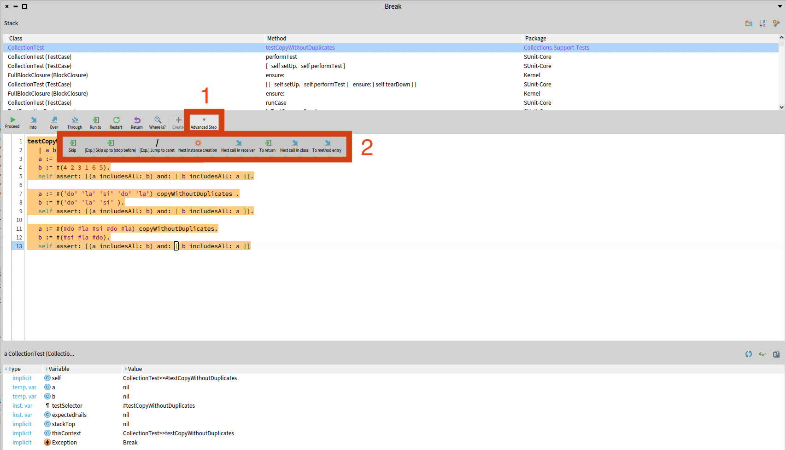
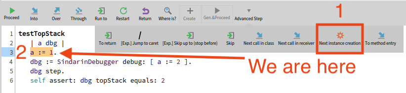
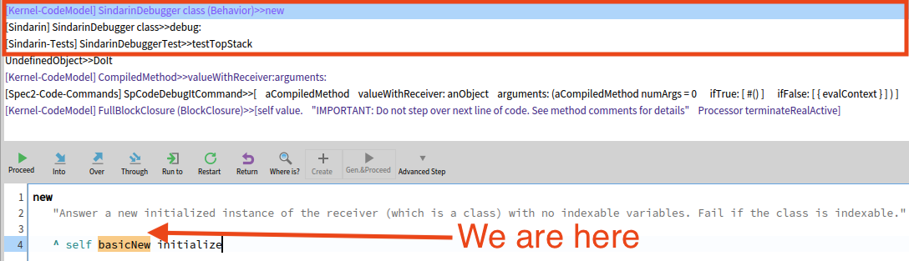
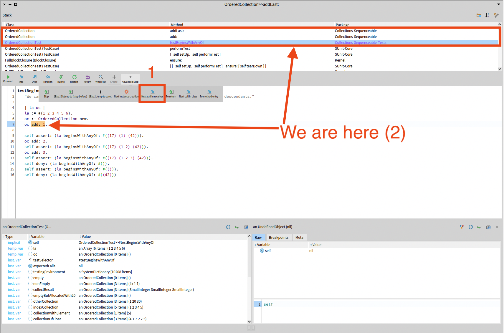
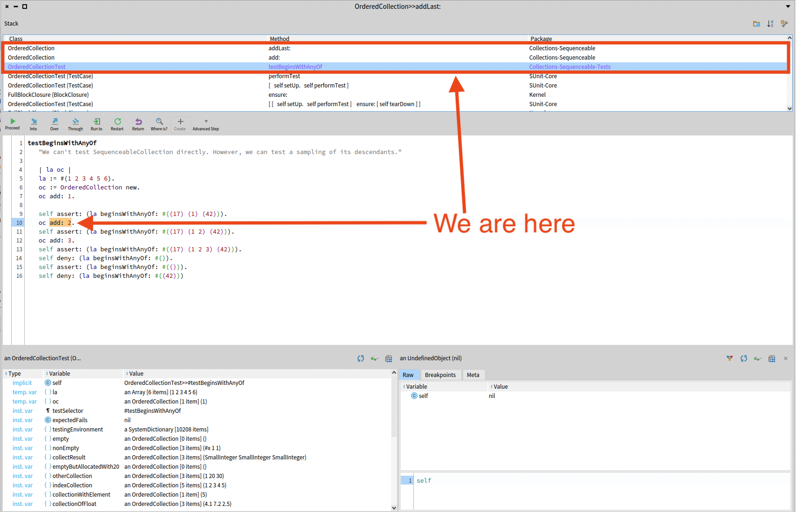

### Advanced Debugger Actions

In this chapter, we describe the advanced debugging commands (2 in the following figure) provided by the "Advanced step" menu (1 in the following figure) in the graphical user interface:

These commands allow to perform steps with bigger granularity than the basic ones, as it may be tedious to debug a program with basic steps.
Some of these commands are experimental features to skip the execution of some parts of the code under debug.

#### Advanced debugging commands of the StDebugger

The debugging commands offered by the StDebugger in the "Advanced step" toolbar are the following ones:

* **Next instance creation:** Steps the execution until a class is instanciated in the current context.
    The execution is stopped and an error message is displayed when one of these situations happen:
    - no class has been instanciated within 1000 steps,
    - an unhandled exception has been raised,
    - the current context has returned to its sender.

    **Example:** 
    After clicking the *Next instance creation* button (referred as 1 in the following figure) from the first assignment of `a` (code location referred as 2 in the figure below),

    

    we get to the next instruction that creates an instance (`#basicNew`), called inside `SindarinDebugger class>>#debug:`:

    

* **Next call in receiver:** Steps the execution until a message is sent to the current context's receiver.
    The execution is stopped and an error message is displayed when one of these situations happen:
    - no message has been sent to the current context's receiver within 1000 steps,
    - an unhandled exception has been raised,
    - the current context has returned to its sender.

    **Example:**
    After clicking the *Next call in receiver* button (referred as 1 in the following figure) from the instruction `oc add: 1` (code location referred as 2 in the figure below),

    

    we get to the next message send `#add:` to the object `oc` with `2` as argument.
    We don't stop on the message `#beginsWithAnyOf:` sent to the object `la` because `la` is a different object from `oc`:

    

* **Next call in class:** Steps the execution until a message is sent to any instance of the class of the current context's receiver.
    The execution is stopped and an error message is displayed when one of these situations happen:
    - no message has been sent to any instance of the current context's receiver's class within 1000 steps,
    - an unhandled exception has been raised,
    - the current context has returned to its sender.

    **Example:**
    After clicking the *Next call in receiver* (referred as 1 in the following figure) from the instruction `oc add: 1` (code location referred as 2 in the figure below),

    

    We stop on the message `#beginsWithAnyOf:` sent to the object `la` because `la` is an instance from the same class as `oc`:

    

* **To return:** Steps the execution until the current context is about to return or until an unhandled exception is raised.

* **To method entry:** Steps the execution until it enters a newly called method.

* **Skip:** Skips an instruction without executing it. 
    Any instruction that is skipped is simulated as if it was executed but no side effect are applied. The arguments of the skipped instruction are consumed and a simulated return value is pushed on the stack when needed.
    What the command does exactly depends on the instruction that is skipped:

    - **message send:** the arguments are consumed, the lookup is not performed and the receiver is pushed on the stack as the result of the method call,
    - **assignment:** the assignment is not executed. If the result of the assignment is supposed to be used by another instruction then the value of the variable that was going to be assigned is pushed on the stack as a replacement value,
    - **return:** the return instruction is skipped if and only if there is another return instruction after this one, further in the method. Otherwise, an exception is raised to tell that this return instruction cannot be skipped,
    - **jump:** we just skip the bytecode that performs the jump,
    - **block creation:** the block is not created, pushes `nil` on the stack instead.

    After the instruction has been skipped, instructions (mainly push/pop instructions) are stepped until the current instruction is one of the 5 above.

* **Skip up to:** Skips several instructions in the same context, without executing them, up to the instruction under the caret.
    The instructions that are skipped are the same that are skipped by the command *skip*: message sends, assignments, returns, jumps and block creations.
    The caret needs to be in the top context: don't forget that a non-inlined block context is not the same as its home context.
    Also, the caret needs to be after the current instruction

* **JumpToCaret:** jumps to the instruction under caret that can be anywhere in the home context, without changing the state of the program.
    This command is similar to the "Skip up to" command except that it is much more powerful as it can be used:
    - to move back and forth in the top context,
    - to enter blocks from its home context,
    - it can be used to exit blocks to go to an instruction within the home context

