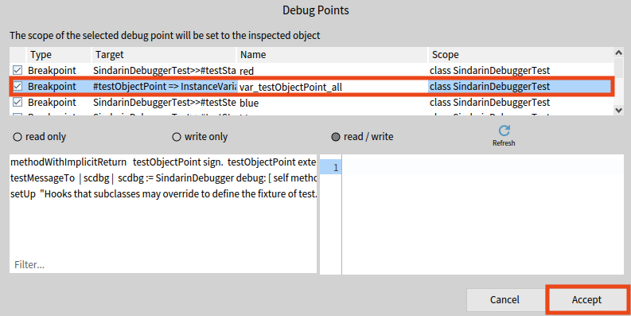

### Debug Points Browser

The debug points browser is a new tool to visualize and configure existing debug points.
Full details on the new debug points model are [described here](../basics/debug-points.md)

The tool can be opened via the `Debug > Debug Point Browser` world menu and looks like that: 

On the top-left (referred as 1 in the figure above), a table allows to visualize all debug points (breakpoints/watchpoints/basic debug points/etc.)
Each debug point has a name, which we could assimilate to a tag, that can be edited directly in this table.
The "enabled" state of the debug point is also displayed via a checkbox, as well as the scope of the debug point (class or object) and its target (a node, an instance variable, etc.).

All behaviors of the selected can be configured via the right pane of the debug point browser (referred as 2 in the figure above).

When a debug point is selected, according to the target of the debug point, different information are displayed.
If the target is an AST node, the code of the concerned method is displayed (referred as 3 in the screenshot above), while highlighting the code corresponding to the target node.
If the target is an instance variable, all concerned methods (referred as 1 in the figure below) are listed and selecting a method displays the corresponding code (referred as 2 in the figure below) and highlights the correct variable accesses:

Also, if the target is an instance variable, it is possible to configure the accesss strategy on which the debug point should be hit (referred as 3 in the figure above).

It is possible to filter the displayed debug points by name, thanks to an input field at the top (referred as 4 in the figure below). Validating the input field will filter so that all the remaining debug points contain the entered sequence of characters in their name:

#### Object-centric debug points

To set object-centric debug points, the second button in the inspector toolbar, with the `objects` icon, allows to do the same thing in the same way as former object-centric breakpoints So, this is possible to set object-centric breakpoints and watchpoints on all variables of a target for this object:

Just as it was possible before debug points existed, it is still possible to set debug points on only some instance variables of the objects.
To do that, from the raw view in the inspector, select the variables you want to watch/break on and right-click to open a context menu to install breakpoints/watchpoints on them:

Moreover, you can set object-centric breakpoints from the meta view in the inspector. Right-click on the method on which you want to break and select **Break on call** or **Break once on call**:

Last but not least, it is also possible to change the scope of an existing debug point to an object, which was not possible before.
The third button in the inspector toolbar, with the `debug` icon, allows to do that and opens a modal to choose a debug point whose scope should be changed to the inspected object:

