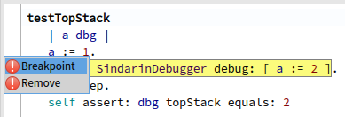
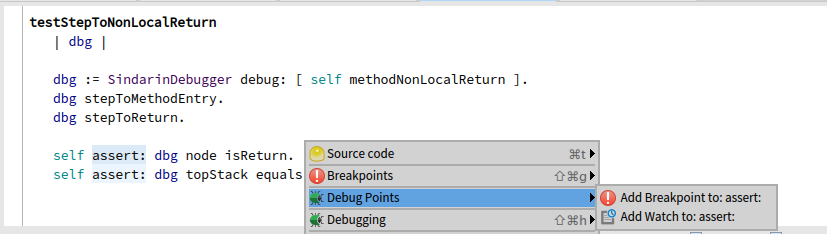
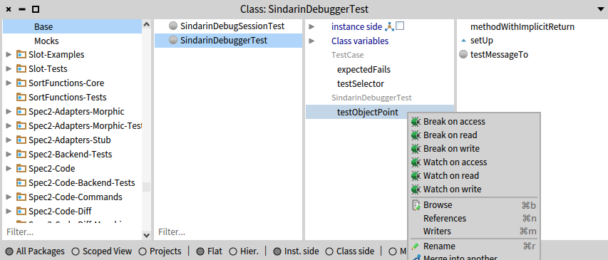

### Debug Points

The debug point system is a model destined to replace the former breakpoint and watchpoint model.

#### Types of debug points

**Debug points** are different types of **instrumentation that are used to debug**. 
For now, there are two concrete types of debug points: **breakpoints and watchpoints**.

As commonly known, breakpoints halts the program and watchpoints saves a value in its history when they are hit.
Basic debug points can also be used but they do nothing unless we add **behaviors** to them.

It is possible to double-click on the left bar in the Calypso browser to set a basic breakpoint on the corresponding line:

Moreover, in the Calypso browser, it is also possible to right-click on a piece of code to set a debug point on the corresponding instruction:

#### Behaviors of debug points

A debug point can have **different types of behaviors** that will execute before the debug point is actually hit.

Among these behaviors, there are:

- *Once* behavior: the debug point becomes disabled after it is hit
- *Count* behavior: counts the number of times the debug point has been hit
- *Condition* behavior: sets a condition that must evaluate to `true` so that the debug point can actually be hit
- *Chain Link* behavior: combines debug points into a chain. In that case, when a debug point is hit in the chain, it disables itself and enables the next debug point in the chain. In other words, each debug points in the chain is hit only once in a specific order
- *Script* behavior: executes a script each time the debug point is hit
- *Transcript* behavior: logs a string to the Transcript each time the debug point is hit

To configure behaviors of existing debug points or at the creation of debug points, it is possible to use an API on `DebugPoint` objects or via the `DebugPointManager`.

It is also possible to configure debug points via a UI tool, the Debug Point Browser, which is detailed [here](../advanced/debug-points-browser.md).

#### Debug Point Targets

Debug points can be installed on different types of targets:

- an *AST node*, which can be targeted by selecting source code in the Calypso browser:
  
  
  In this case, the debug point is reached when the corresponding code is executed. 
  *NB: To put basic breakpoints quickly on AST nodes, it is still possible to double-click the left bar in the method editor, just like with the ancient breakpoint system:*

  
  
  **API:**
  + `DebugPointManager installNew: aDebugPointClass on: anASTNode`: instanciates a debug point class, configured with no behavior, and installs it on on an AST node 
  + `DebugPointManager installNew: aDebugPointClass on: aNode withBehaviors: aListOfBehaviorClasses`: instanciates a debug point class, configured with the list of behavior classes, and installs it on on an AST node 
- a *variable*, which can be targeted by selecting a variable in the variable view in the Calypso browser:

  

  In this case, the debug point is reached each time the targeted variable is read or/and written, according to the debug point's configuration.

  **API:**
  + `DebugPointManager installNew: aDebugPointClass inClass: aClass onVariableAccessNamed: aSlotNameSymbol`: instanciates a debug point class, configured with no behavior, and installs it on the instance variable, whose name is given as argument, in a class hierarchy. The debug point is reached at each reading or writing of this variable.
  + `DebugPointManager installNew: aDebugPointClass inClass: aClass onVariableAccessNamed: aSlotNameSymbol withBehaviors: aListOfBehaviorClasses`: instanciates a debug point class, configured with the list of behavior classes, and installs it on the instance variable whose name is given as argument, in a class hierarchy. The debug point is reached at each reading or writing of this variable.
  + `DebugPointManager installNew: aDebugPointClass inClass: aClass onVariableReadNamed: aSlotNameSymbol`: instanciates a debug point class, configured with no behavior, and installs it on the instance variable whose name is given as argument, in a class hierarchy. The debug point is reached at each reading of this variable.
  + `DebugPointManager installNew: aDebugPointClass inClass: aClass onVariableReadNamed: aSlotNameSymbol withBehaviors: aListOfBehaviorClasses`: instanciates a debug point class, configured with the list of behavior classes, and installs it on the instance variable whose name is given as argument, in a class hierarchy. The debug point is reached at each reading of this variable.
  + `DebugPointManager installNew: aDebugPointClass inClass: aClass onVariableWriteNamed: aSlotNameSymbol`: instanciates a debug point class, configured with no behavior, and installs it on the instance variable whose name is given as argument, in a class hierarchy. The debug point is reached at each writing to this variable.
  + `DebugPointManager installNew: aDebugPointClass inClass: aClass onVariableWriteNamed: aSlotNameSymbol withBehaviors: aListOfBehaviorClasses`: instanciates a debug point class, configured with the list of behavior classes, and installs it on the instance variable whose name is given as argument, in a class hierarchy. The debug point is reached at each writing to this variable.
- an *object*, in order to install object-centric debug points. This type of target **wraps another target** (AST node or variable). In this case, the debug point is reached only if the wrapped target is reached and if the receiver is the target instance.

  **API:**
  + `DebugPointManager installNew: aDebugPointClass on: anASTNode forObject: anObject`: instanciates a debug point class, configured with no behavior, and installs it on on an AST node. The debug point is hit only if the receiver is the target object given as argument.
  + `DebugPointManager installNew: aDebugPointClass on: aNode withBehaviors: aListOfBehaviorClasses forObject: anObject`: instanciates a debug point class, configured with the list of behavior classes, and installs it on on an AST node. The debug point is hit only if the receiver is the target object given as argument.
  + `DebugPointManager installNew: aDebugPointClass forObject: anObject onVariableAccessNamed: aSlotNameSymbol`: instanciates a debug point class, configured with no behavior, and installs it on the instance variable, whose name is given as argument, only for the target object given as argument. The debug point is reached at each reading or writing of this variable.
  + `DebugPointManager installNew: aDebugPointClass forObject: anObject onVariableAccessNamed: aSlotNameSymbol withBehaviors: aListOfBehaviorClasses`: instanciates a debug point class, configured with the list of behavior classes, and installs it on the instance variable whose name is given as argument, only for the target object given as argument. The debug point is reached at each reading or writing of this variable.
  + `DebugPointManager installNew: aDebugPointClass forObject: anObject onVariableReadNamed: aSlotNameSymbol`: instanciates a debug point class, configured with no behavior, and installs it on the instance variable whose name is given as argument, only for the target object given as argument. The debug point is reached at each reading of this variable.
  + `DebugPointManager installNew: aDebugPointClass forObject: anObject onVariableReadNamed: aSlotNameSymbol withBehaviors: aListOfBehaviorClasses`: instanciates a debug point class, configured with the list of behavior classes, and installs it on the instance variable whose name is given as argument, only for the target object given as argument. The debug point is reached at each reading of this variable.
  + `DebugPointManager installNew: aDebugPointClass forObject: anObject onVariableWriteNamed: aSlotNameSymbol`: instanciates a debug point class, configured with no behavior, and installs it on the instance variable whose name is given as argument, only for the target object given as argument. The debug point is reached at each writing to this variable.
  + `DebugPointManager installNew: aDebugPointClass forObject: anObject onVariableWriteNamed: aSlotNameSymbol withBehaviors: aListOfBehaviorClasses`: instanciates a debug point class, configured with the list of behavior classes, and installs it on the instance variable whose name is given as argument, only for the target object given as argument. The debug point is reached at each writing to this variable.
