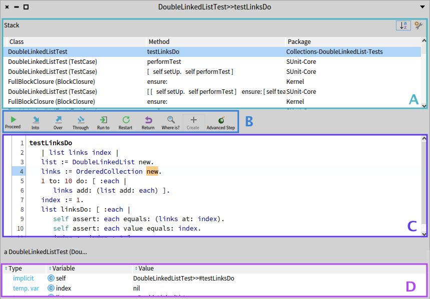

## Elements of the debugger

In this chapter, we describe the standard debugging features, workflow, and the debugger user interface to contextualize our implementations.

The *StDebugger*~(\autoref{fig:stdebugger}) is an interactive debugger for Pharo programs.
To start debugging and exploring a program, developers use breakpoints to automatically break the program at certain points in its execution.
When a breakpoint is hit, the StDebugger obtains control of the program execution, and its GUI is shown.

 

The debugger shows the Stack~(\autoref{fig:stdebugger}~a), a visual representation of what, in general terminology, is known as the execution call stack.
Developers manually step through the execution by using the commands (\autoref{fig:stdebugger}~b).
After any debugging action, the code presenter (\autoref{fig:stdebugger}~c) is updated and highlights the source code that will be executed in the next step.
Developers observe execution data using the inspector (\autoref{fig:stdebugger}~d) in addition to the stack.
%It allows developers to control a program thread execution (a \texttt{Process}) which is advanced by performing \textit{stepping operations} that are available in the debugging commands toolbar.

The Pharo StDebugger main GUI elements. Composed by the stack (a), the debugging commands toolbar (b), the code presenter (c), and the debugger inspector (d)

