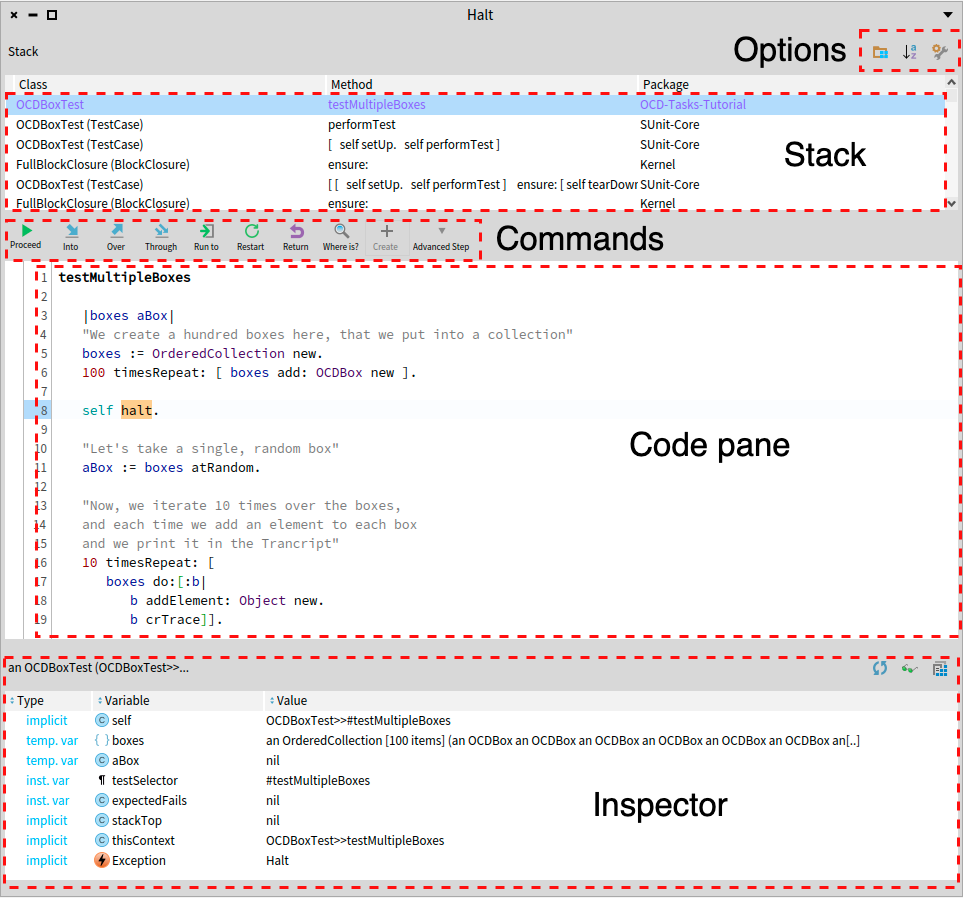

### Elements of the Debugger

In this chapter, we describe the elements of the debugger graphical user interface. 

To start debugging and exploring a program, developers use breakpoints to automatically break the program at certain points in its execution.
When a breakpoint is hit, the StDebugger obtains control of the program execution, and its GUI is shown.

 

The debugger shows the Stack~(\autoref{fig:stdebugger}~a), a visual representation of what, in general terminology, is known as the execution call stack.
Developers manually step through the execution by using the commands (\autoref{fig:stdebugger}~b).
After any debugging action, the code presenter (\autoref{fig:stdebugger}~c) is updated and highlights the source code that will be executed in the next step.
Developers observe execution data using the inspector (\autoref{fig:stdebugger}~d) in addition to the stack.
%It allows developers to control a program thread execution (a \texttt{Process}) which is advanced by performing \textit{stepping operations} that are available in the debugging commands toolbar.

The Pharo StDebugger main GUI elements. Composed by the stack (a), the debugging commands toolbar (b), the code presenter (c), and the debugger inspector (d)

!!Structure of the Pharo debugger

!!!Sub-presenters and layouts
The debugger is composed of default views and extension views.
Default views are the stack, the commands, the status line, the code pane and the inspector.
An extension view automatically appears if any debugging extension is present and if extensions are activated in the settings.
If not, extensions do not appear.

Default and extension views are available in a vertical and an horizontal layout.
It is configureable in the settings under ==Tools >> Debugging >> Debugger layout==.
It is possible to fully customize the debugger layout, and therefore to add or remove any view.
The customized layout must then me selected in the aforementioned setting to be set as default.
To appear in that setting's list of possible values, the layout must be implemented in a method under the ==specs== protocol of the ==StDebugger== class side.

""The stack.""
It shows the call stack of the current interrupted context.
Each element in the stack is a context representing a message send.

The context menu (through right click) provides different interactions with the selected stack element: inspection, exploration, exportation, etc.

By default, only a small part of the stack is shown.
More of the stack is observable by either clicking on the bottom context (the last in the stack) or through the context menu.

""Commands.""
Commands are actions applicable to the current context
After each debugging action (''e.g.'', a step), the list of commands is being updated.
New commands may appear or disappear.
It depends if they are applicable or not to the current context and debugging session.
For instance, when a ==doesNotUnderstand== exception is raised (''i.e.'', a method does not exist), the command ''createMethod'' will appear.
In that case, it gives users the possibility to create the missing method and continue the execution.

""The status line.""
This view provides information about the current context.
Non-critical information, such as the current instruction being stepped, are displayed in gray.
Critical information ,such as halts or breakpoints or DNU exceptions, are displayed in red.

""The code.""
The code pane shows the source code of the interrupted context's method.
The source code is annotated with informations about the position of the interrupted execution.
This position corresponds to the next execution that will be executed if a step action is performed.
It is coloured in blue if that instruction is selected in the source code, or in orange and underlined if the selection is empty.

A context menu (through right click) provides inspection, exploration, and stepping actions applicable to the context.
Such actions include, ''e.g.'', browse implementors of a selected message or skip execution of selected parts of the code.

""The inspector.""
It provides views on the current context.
It contains tabs with different inspections or views on the current context or on the system.

The raw inspection shows three items: ''Receiver'', ''Temps'' and ''Context''.
The receiver item shows information about the receiver of the message, or the object executing the method from the context.
The temps item shows the temporary variables of the current context.
Finally, the context item shows lower-level details, such as the interrupted context, the debug session or the debugger itself.
Double-clicking on an item will spawn a new view in the same inspector, with an inspection on the selected item.

The breakpoints inspection shows all breakpoints installed for the current receiver.
Those breakpoints are either installed on the receiver's class (''e.g.'', halts) or on that specific receiver (''i.e.'', object-centric breakpoints or halts.)
Ticking or unticking a breakpoint in that list will activate or deactivate that breakpoint.

The meta inspection shows methods of the receiver's class hierarchy.
Methods can be modified and saved in directly in that pane.

+Debugger views (OLD PICTURE)>file://images/debugger-structure-2.png+
