### Introduction

Chest allows you to store objects from anywhere, to keep them around to check equality...   

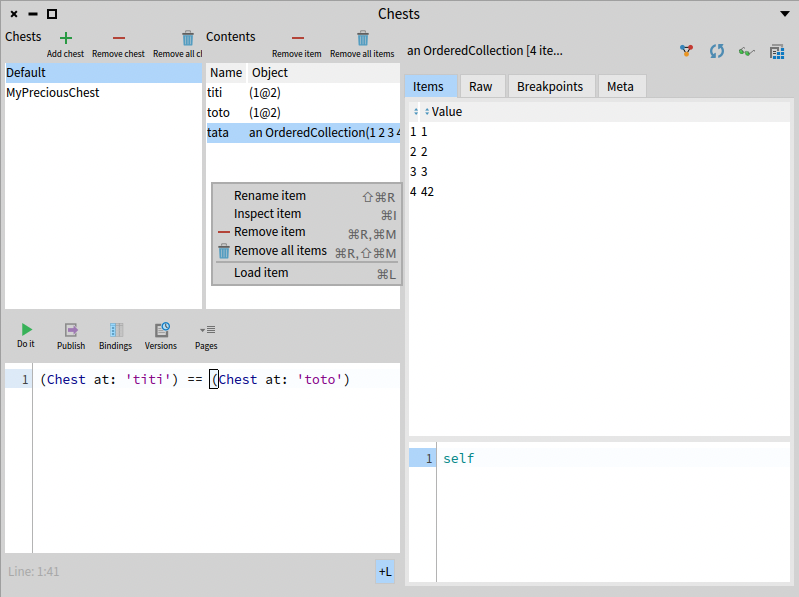
  
#### Original repository

[Link to original repository](https://github.com/dupriezt/Chest)

#### Install Chest
```smalltalk
Metacello new
    baseline: 'Chest';
    repository: 'github://pharo-spec/Chest';
    load.
```

#### Open Chest
Chest is available in the **world menu** of Pharo. It is available as an **entry of the Debug menu**

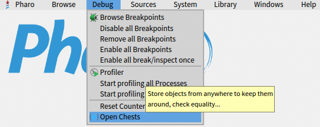

You can also enable it as a debugger extension in the debugging settings of Pharo:

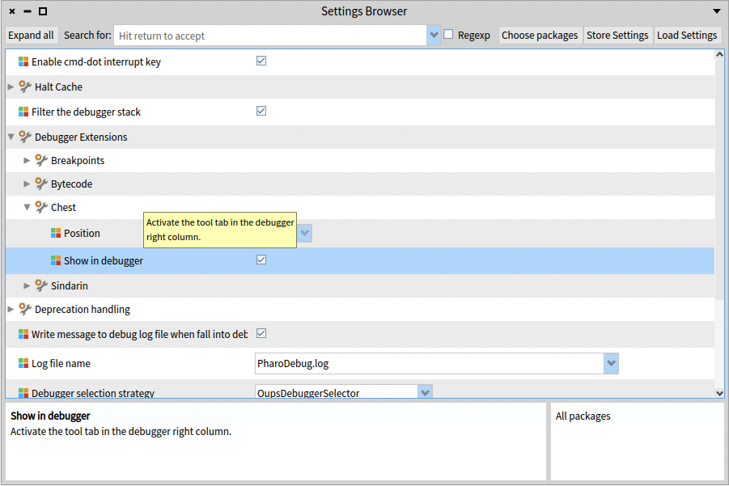

In the debugger, Chest will provide a view as a tree of all chests with the objects inside.

> Maybe we need an image of the tree view here?

#### More Details

##### Name (= ID)

Each Chest instance has an ID (String). These IDs are unique. Two chests cannot have the same ID.

##### Default Chest

This is an instance of Chest that can be interacted with in the same way as any other Chest by sending the messages to the `Chest` class.

##### Weak Chests

```Smalltalk
Chest weak
```

is a way to access the class `WeakChest`. This class can be interacted with the same way as you would with the `Chest` class.

`WeakChest` has its own default chest, and can be used to manipulate this default chest or to create new weak chests.

##### Commands in context

###### Store object into chest

If you right-click on a code presenter with an `SpCodeInteractionModel` or `StDebuggerContextInteractionModel` (e.g: playground, debugger etc.), you can evaluate an expression and store the result in the chest of your choice, with the name of your choice:

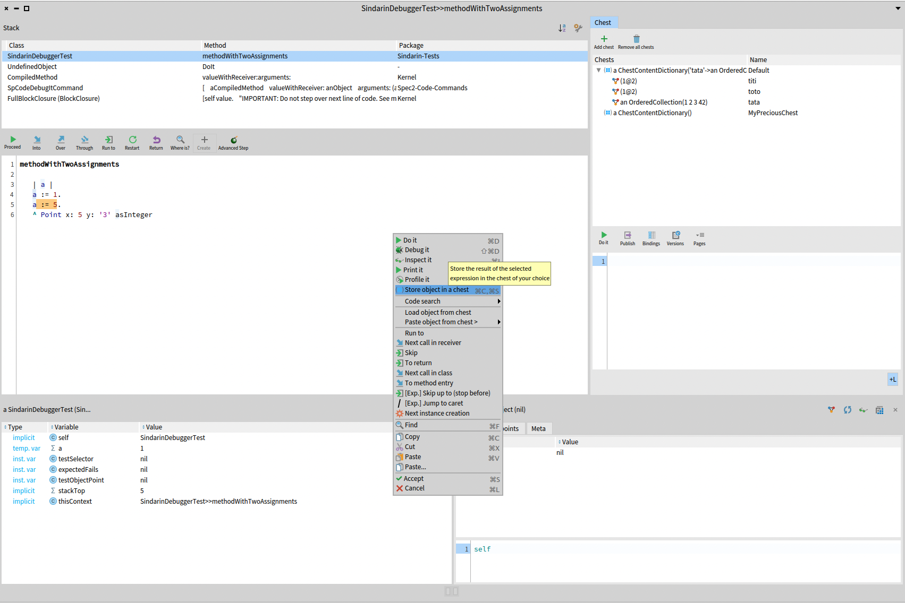

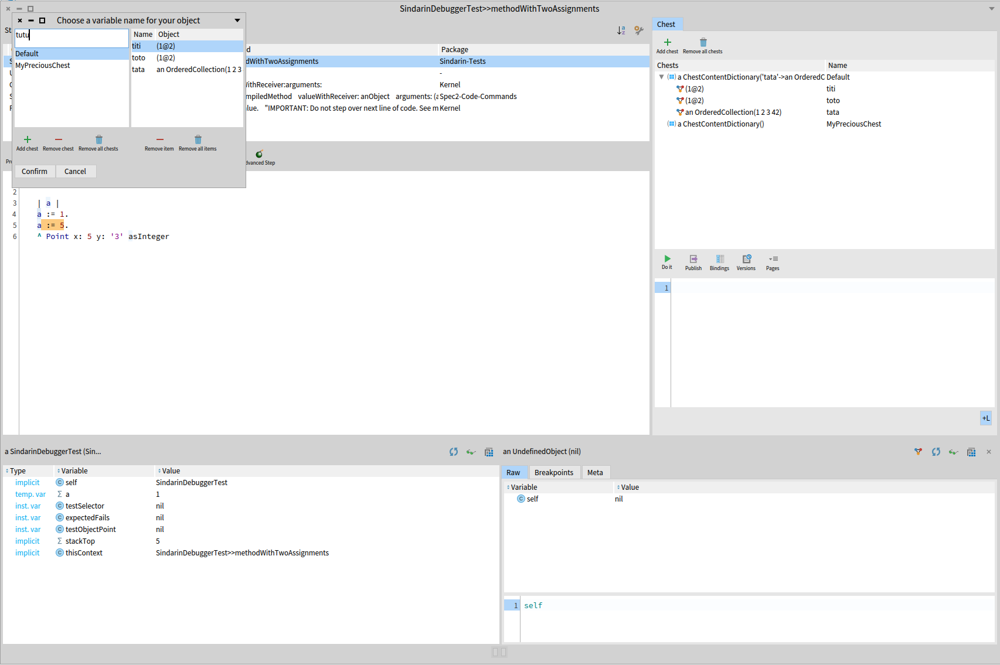

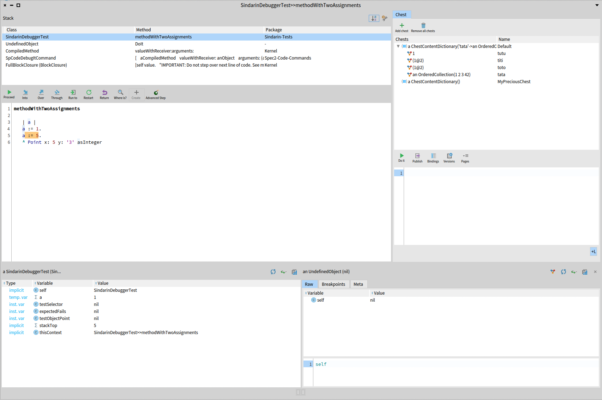

###### Load object from a chest into a playground or a debugger

It's also possible to load objects from a chest into these code presenters:

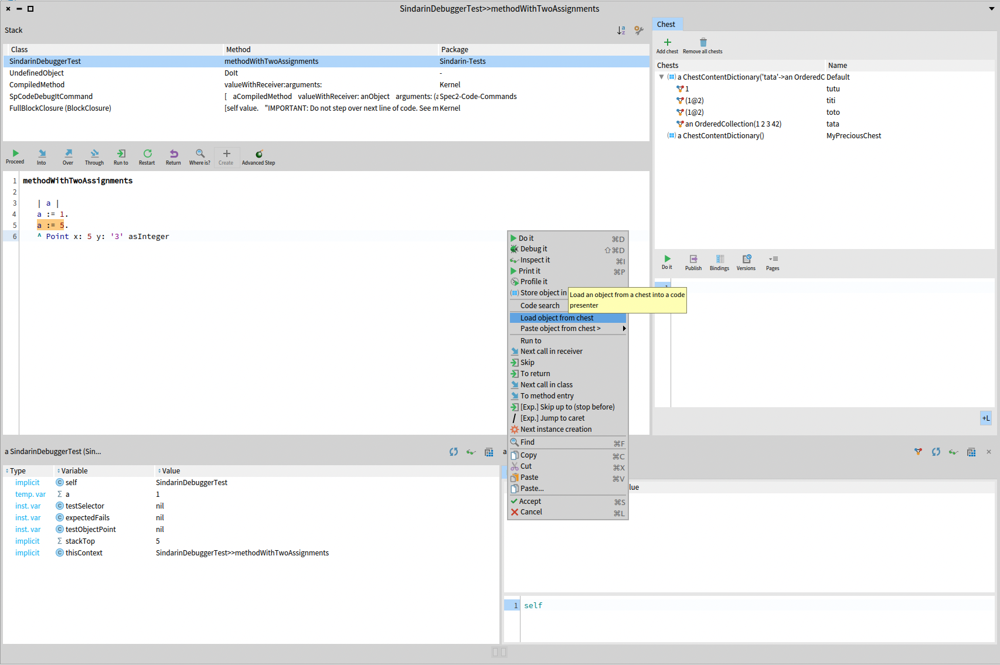

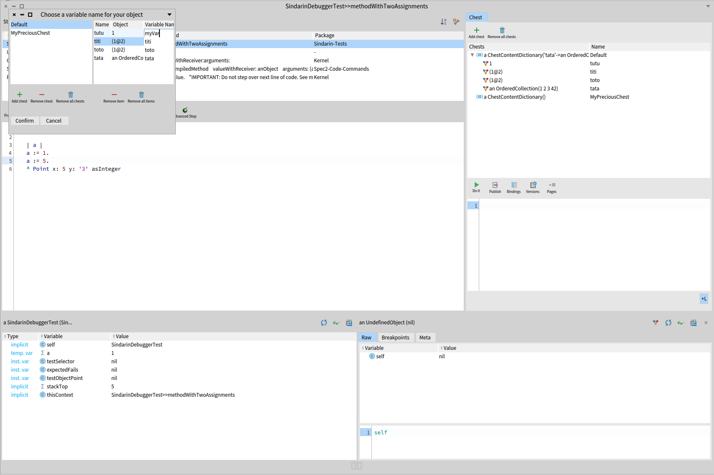

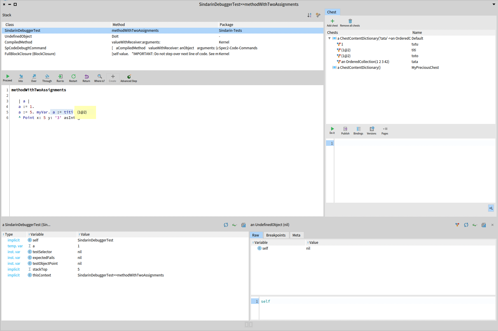

And then variables can be seen from any other context if it has been loaded in a debugger and these variables can be seen in the debugger inspector:

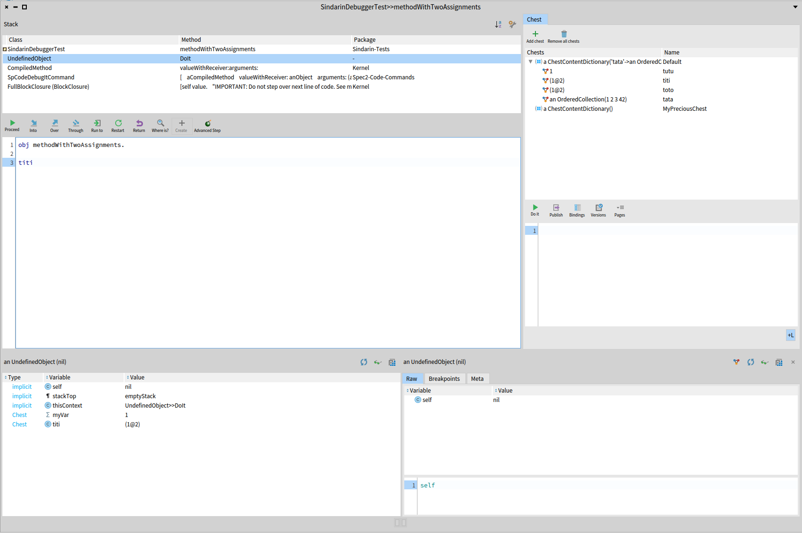

Chest, as a debugger extension, provides a playground. All bindings between this playground and the debugger selected context are shared. So: all variables defined in this playground are recognized by the debugger and all variables from the debugger's selected context or loaded from Chest into the debugger are recognized by the playground. However, only the variables loaded from Chest (via the load menu entry described above) are displayed in the debugger inspector:

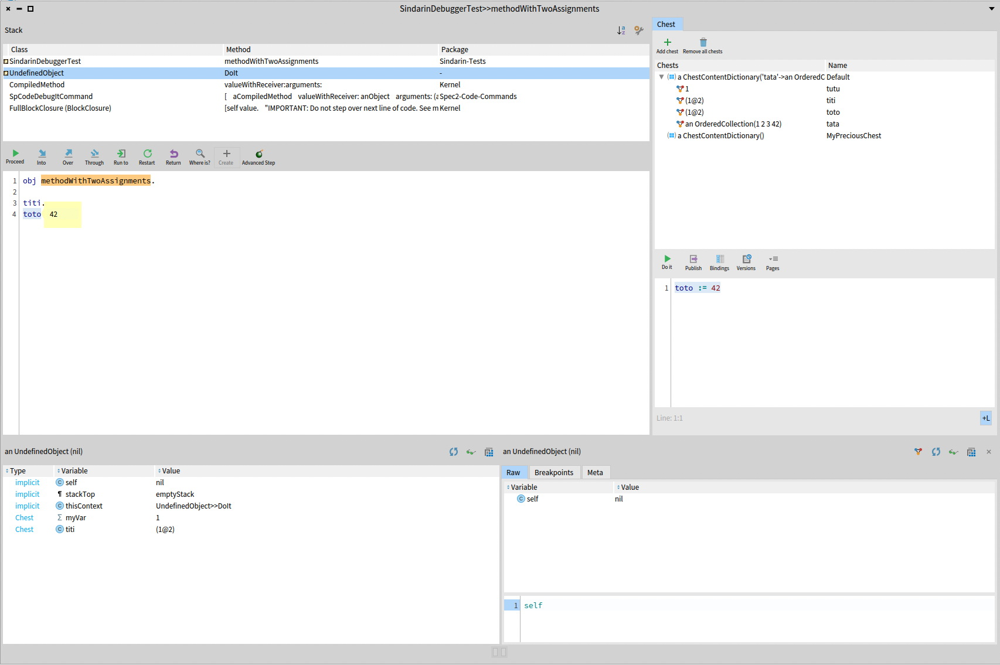

###### Inject code to access an object inside a chest, in a playground or in the debugger

To make it easier to access the content of a chest in a playground or in the debugger, it is possible to use the **Paste object from chest >** sub-menu.
This sub-menu allows to choose a chest and the key of an object inside the chest.

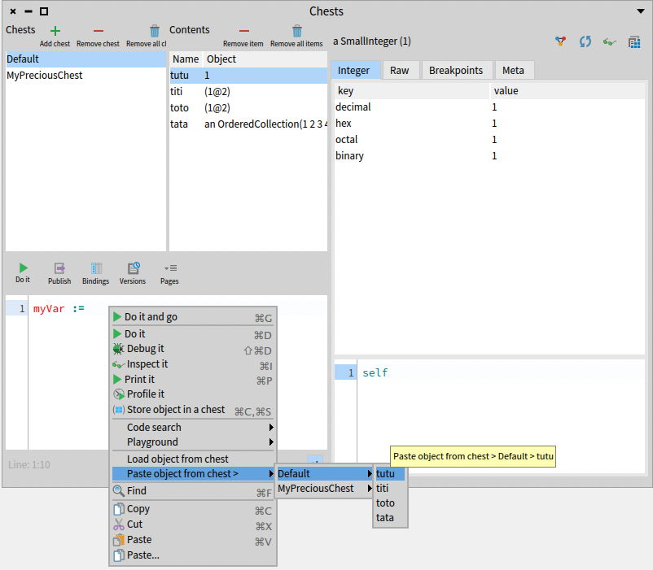

When clicking on a variable name, the necessary code to access the corresponding object is pasted where you had put your cursor in the playground/debugger:

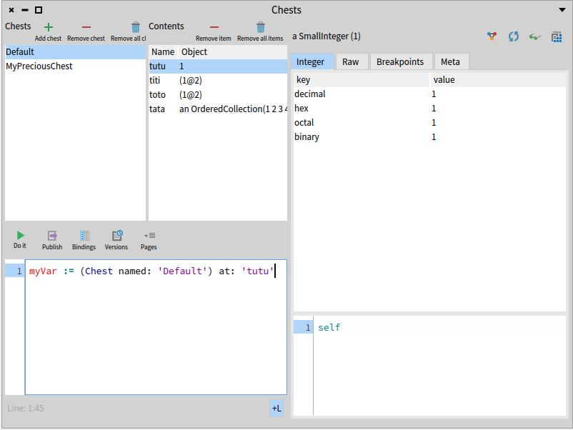

This command allows you to access objects from a chest, without relying on your memory of the `Chest` API.

###### Simpler code injection in any spec code presenter

The method described above to access objects in chests implies that your objects need to be stored in a chest with a name that you must remember...

Sometimes, you would like to access objects quickly, without needing to give a name to an object that is stored...

That's why it is possible to copy / paste (=inject code to access) to / from a "Clipboard Chest", just as you would do to copy/paste text to/from the clipboard.

To do that, you just need to select the expression that you want to evaluate and whose results should be stored in the "Clipboard Chest", and then select **Copy object in a clipboard chest** in the context menu:

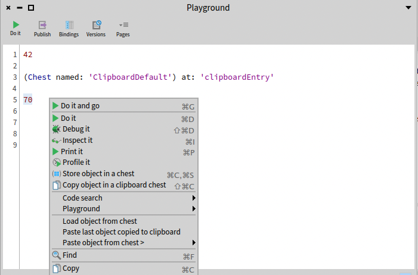

This will store the result of the expression into the default clipboard chest. Please note, that if you "copy" another object to the clipboard chest, it will replace the previous copied object. Note also that the clipboard chest is a weak chest, so your object inside the clipboard chest can become `nil` if it gets garbage-collected.

In order to inject the code to access the object, you should then select in the context menu: **Paste last object copied to clipboard**:

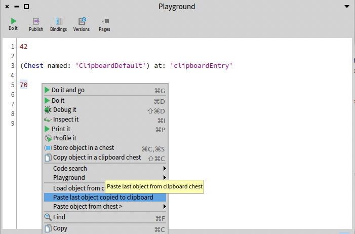

And the code to access your object is now pasted:

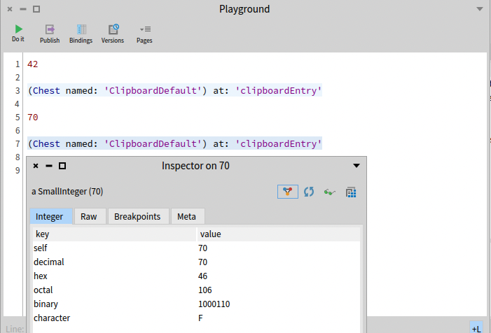
