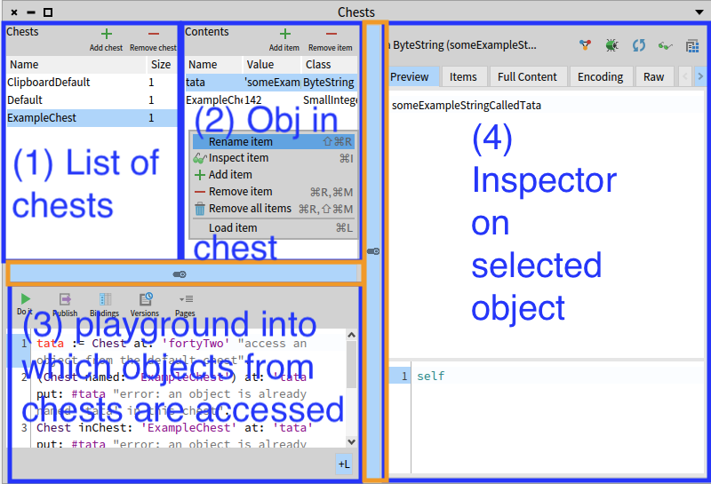

### Chest Graphical User Interface

To be able to visualize more easily the stored objects, _Chest_ provides a _GUI_.
A table, referred as 1 in Figure *@fig:chest-overview@*, displays the name of all existing chests in the system, as well as the number of objects inside it.
When selecting a chest in this table, all objects from this chest inside it are displayed in another table next to it, referred as 2 in Figure *@fig:chest-overview@*.
For each of these objects, their name, class and value are displayed in this table.

This list (resp. table) provides a context menu and buttons to perform actions on the selected chest (resp. object in chest), such as: adding a new chest, renaming/removing chest (resp. object in chest) and load all chest's bindings (resp. the selected object's binding) in the playground, referred as 3 in Figure *@fig:chest-overview@*.
A playground is a presenter in which developers can write scripts.
When a chest's binding is loaded into it, the developer can use the corresponding variable in this playground, to compare objects for example.
Finally, an inspector on the selected object, referred as 4 in Figure *@fig:chest-overview@* allows to (mainly) visualize the values of its instance variables.

