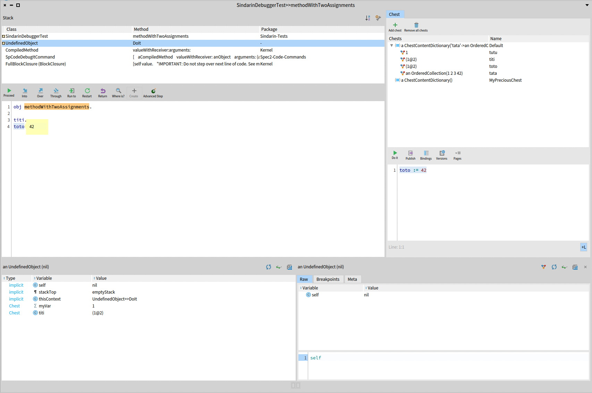

### Chest Integration to Pharo

In addition to providing its main _GUI_ described in the previous chapter, _Chest_ is also integrated to other tools in Pharo in differents ways.

#### Chest Commands in context menus

_Chest_ provides a lot of commands to ease its use in the other Pharo tools, accessible from the context menu of these tools.
This section describes each of these commands

##### Store object into chest

 

By right-clicking on a code presenter with an `SpCodeScriptingInteractionModel` or `StDebuggerContextInteractionModel` (e.g: playground, debugger), it is possible to evaluate an expression and store the result object into a chest (Figure *@fig:chest-store-context-menu@*).
In the example in (Figure *@fig:chest-store-context-menu@*), we want to store the value of the variable `a` inside a chest.

Clicking on this menu entry opens a popup that asks to choose from the chest table the chest that will contain the object, as well as the name that this object should have in the selected chest (referred as 1 in Figure *@fig:chest-store-object-popup@*).
Various options, referred as 2 in *@fig:chest-store-object-popup@*, allow to parameter what should be stored: the object itself, a shallow copy of the object or a deep copy of the object.
In the example in Figure *@fig:chest-store-object-popup@*, we store the value of the variable `a`, in the chest whose name is _ExampleChest_, named as _ExampleChest\_2_.

##### Load object from a chest into a playground or a debugger

By right-clicking on a code presenter with an `SpCodeScriptingInteractionModel` or `StDebuggerContextInteractionModel` (e.g: playground, debugger), it is also possible to load one or several objects from a chest into these code presenters (Figure *@fig:chest-load-context-menu@*).

Clicking on this menu entry opens a popup that asks to choose from which chest the object(s) should be loaded as well as the name under which these object(s) should be loaded into the target code presenter.
In the example in Figure *@fig:chest-load-object-popup@*, the objects named _tata_ and _ExampleChest\_1_ will be respectively loaded as _tata_ and _toto_ into the debugger.

Then these variables can be evaluated from the debugger they have been loaded into (Figure *@fig:chest-variable-usage-after-load@*).

##### Inject code to access an object inside a chest from any spec code presenter

By right-clicking on any Spec code presenter, a sub-menu named _Paste object from chest >_ makes it easier to access an object contained in a chest. 
This submenu contains a subsubmenu for each chest, which contain a menu entry for each object name contained in the chest (Figure *@fig:chest-paste-object-from-chest-context-menu@*).

When clicking on a menu entry, the necessary code to access the corresponding object is pasted in the Spec code presenter (Figure *@fig:chest-injected-code-after-paste@*)

This command allows users to access objects from a chest, without them having to remind themselves of the `Chest` API.

##### Simpler code injection from any spec code presenter

The previous section described a way to inject code to access objects in chests from a Spec code presenter, without needing to remember the _Chest_ API.
However, this implies that your objects need to be stored in a chest with a name that the user needs to remember.

Sometimes, users would like to access objects quickly, without needing to give a name neither to an object that is stored, nor to the chest that will contain the object.

Therefore, it is possible to "copy" an object from a Spec code presenter to "paste" it into another Spec code presenter, by using a "clipboard" of objects.

To do that, users just need to select the expression they want to evaluate and whose results should be accessed from another Spec code presenter. 
By right-clicking on the code presenter containing this expression, clicking on the _Copy object in a clipboard chest_ it stores the result of the selected expression into a clipboard of objects, which is actually the default _ClipboardChest_ (Figure *@fig:chest-copy-object-to-clipboard-context-menu@*).

Then, after copying the object to the clipboard chest, it is possible to access it from any other Spec code presenter with the _Paste last object copied to clipboard_ menu entry (Figure *@fig:chest-paste-last-object-from-clipboard-context-menu@*).

After clicking on this menu entry, the code to access the last object that was stored into the clipboard chest is pasted (Figure *@fig:chest-injected-code-after-paste-from-clipboard@*).

An object copied to the clipboard can be accessed until one of the following conditions is filled:
- the object has been garbage-collected if it is not referenced anywhere else in the system,
- 10 objects have been stored into the clipboard chest after this object has been stored into the clipboard chest.

#### Integration in debugger

Chest, as a debugger extension, provides a playground. All bindings between this playground and the debugger selected context are shared. So: all variables defined in this playground are recognized by the debugger and all variables from the debugger's selected context or loaded from Chest into the debugger are recognized by the playground.

