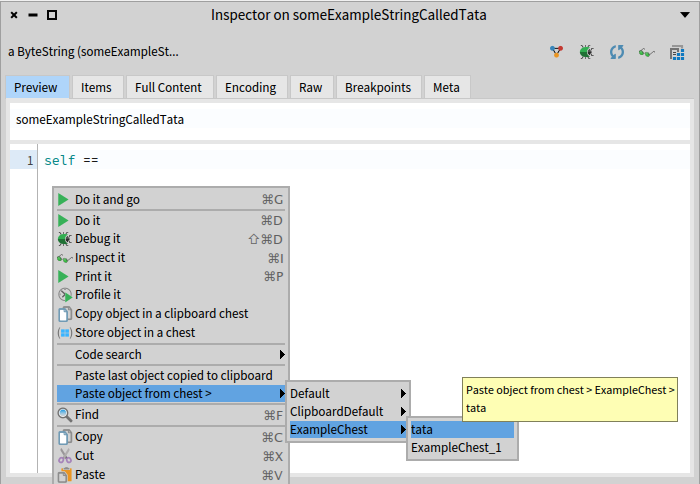
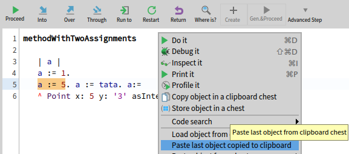

### Chest Integration to Pharo

In addition to providing its main _GUI_ described in the previous chapter, _Chest_ is also integrated to other tools in Pharo in differents ways.

#### Chest Commands in context menus

_Chest_ provides a lot of commands to ease its use in the other Pharo tools, accessible from the context menu of these tools.
This section describes each of these commands

##### Store object into chest

 

By right-clicking on a code presenter with an `SpCodeScriptingInteractionModel` or `StDebuggerContextInteractionModel` (e.g: playground, debugger), it is possible to evaluate an expression and store the result object into a chest (Figure *@fig:chest-store-context-menu@*).
In the example in (Figure *@fig:chest-store-context-menu@*), we want to store the value of the variable `a` inside a chest.

Clicking on this menu entry opens a popup that asks to choose from the chest table the chest that will contain the object, as well as the name that this object should have in the selected chest (referred as 1 in Figure *@fig:chest-store-object-popup@*).
Various options, referred as 2 in *@fig:chest-store-object-popup@*, allow to parameter what should be stored: the object itself, a shallow copy of the object or a deep copy of the object.
In the example in Figure *@fig:chest-store-object-popup@*, we store the value of the variable `a`, in the chest whose name is _ExampleChest_, named as _ExampleChest\_2_.

##### Load object from a chest into a playground or a debugger

By right-clicking on a code presenter with an `SpCodeScriptingInteractionModel` or `StDebuggerContextInteractionModel` (e.g: playground, debugger), it is also possible to load one or several objects from a chest into these code presenters (Figure *@fig:chest-load-context-menu@*).

Clicking on this menu entry opens a popup that asks to choose from which chest the object(s) should be loaded as well as the name under which these object(s) should be loaded into the target code presenter.
In the example in Figure *@fig:chest-load-object-popup@*, the objects named _tata_ and _ExampleChest\_1_ will be respectively loaded as _tata_ and _toto_ into the debugger.

Then these variables can be evaluated from the debugger they have been loaded into (Figure *@fig:chest-variable-usage-after-load@*).

##### Inject code to access an object inside a chest, in a playground or in the debugger

To make it easier to access the content of a chest in a playground or in the debugger, it is possible to use the **Paste object from chest >** sub-menu.
This sub-menu allows to choose a chest and the key of an object inside the chest.

When clicking on a variable name, the necessary code to access the corresponding object is pasted where you had put your cursor in the playground/debugger:

This command allows you to access objects from a chest, without relying on your memory of the `Chest` API.

##### Simpler code injection in any spec code presenter

The method described above to access objects in chests implies that your objects need to be stored in a chest with a name that you must remember...

Sometimes, you would like to access objects quickly, without needing to give a name to an object that is stored...

That's why it is possible to copy / paste (=inject code to access) to / from a "Clipboard Chest", just as you would do to copy/paste text to/from the clipboard.

To do that, you just need to select the expression that you want to evaluate and whose results should be stored in the "Clipboard Chest", and then select **Copy object in a clipboard chest** in the context menu:

This will store the result of the expression into the default clipboard chest. Please note, that if you "copy" another object to the clipboard chest, it will replace the previous copied object. Note also that the clipboard chest is a weak chest, so your object inside the clipboard chest can become `nil` if it gets garbage-collected.

In order to inject the code to access the object, you should then select in the context menu: **Paste last object copied to clipboard**:

And the code to access your object is now pasted:

#### Integration in debugger

Chest, as a debugger extension, provides a playground. All bindings between this playground and the debugger selected context are shared. So: all variables defined in this playground are recognized by the debugger and all variables from the debugger's selected context or loaded from Chest into the debugger are recognized by the playground.

