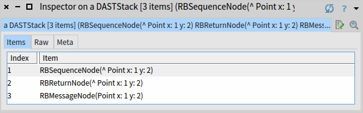
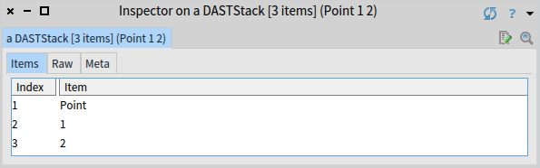
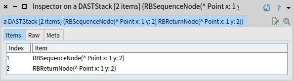
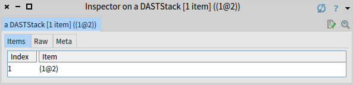

## The Debuggable AST Interpreter

This chapter was written, based on this version of Pharo: `Pharo-13.0.0+SNAPSHOT.build.144.sha.ac276f94e7831a3329f686b3a6fa842ca3c8832e (64 Bit)`

### How to use the interpreter

#### Load the interpreter

To load the AST interpreter only, open a playground and execute this code to load the baseline:

```Smalltalk
Metacello new
    baseline: 'DebuggableASTInterpreter';
    repository: 'github://adri09070/DebuggableASTInterpreter:Oups-DAST-handling';
    load.
```

#### Example

In a playground, instanciate an interpreter and initialize it with the program you want it to interpret (here: `Point x: 1 y: 2`):

```Smalltalk
interpreter := DASTInterpreter new.
interpreter initializeWithProgram: (RBParser parseExpression: 'Point x: 1 y: 2').
```

You can see the stack of AST nodes the current context still has to interpret by inspecting: `interpreter currentContext nodes`. The nodes will be interpreted from last to first.

*Node stack:*  


You can see the value stack of the current context (where the interpreter pushes the values of the AST nodes it interprets) by inspecting: `interpreter currentContext stack`. It is empty at the moment because nothing has been evaluated yet.


Evaluate `interpreter stepInto` 3 times to evaluate the receiver and arguments of the `#x:y:` message being interpreted.  

*New node stack:*  
  

*New value stack:*  
  


Finally, the message send itself is ready to be interpreted. If you evaluate `interpreter stepOver`, the interpreter will pop the receiver and arguments from the value stack, evaluate the message send completely, and push its value on the value stack.  

*New node stack:*  
  

*New value stack:*  
  

As you can see, the value of the message send is the point it created: `(1@2)`

### How to use the DAST debugger

#### Load the debugger

To load the AST interpreter with its debugger, open a playground and execute this code to load the baseline:

```Smalltalk
Metacello new
    baseline: 'DebuggableASTInterpreter';
    repository: 'github://adri09070/DebuggableASTInterpreter:Oups-DAST-handling';
    load: #DebuggerXP.
```

#### Example

