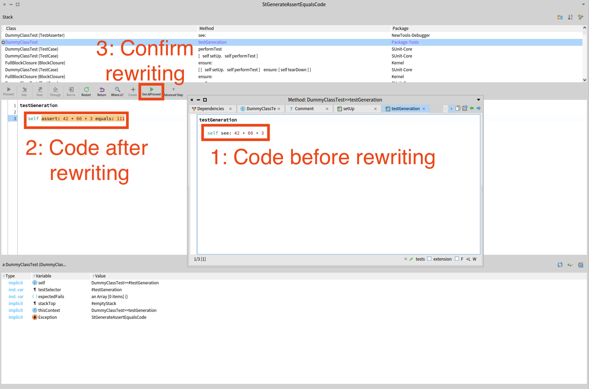

# Debugger driven development

## Semi-automatic code generation in the debugger 

When you are writing tests, certain assertions have a purpose to automatically raise an exception to open a debugger and make the assertion fail.

When these assertions fail, this rewrites the assertion into another assertion that would make the test pass.

For example, if you use the assertion `see:` (1 in the following figure) in a test, it will evaluate its argument and rewrite the assertion into an assertion `assert:equals:` (2 in the following figure) with the result of the evaluated expression as second argument.
You can then judge by yourself if the actual value is correct or not.
According to your judgement, you can either: 
- click on **Gen&Proceed** in the debugger action bar (3 in the following figure) to confirm the code rewriting and proceed your program.
- fix the test (or the tested code) until you are satisfied with the generated code.

For now, the only exception allowing to automatically rewrite code allows to design tests.
However, the system has been designed to allow exceptions to generate any type of code, not solely tests.