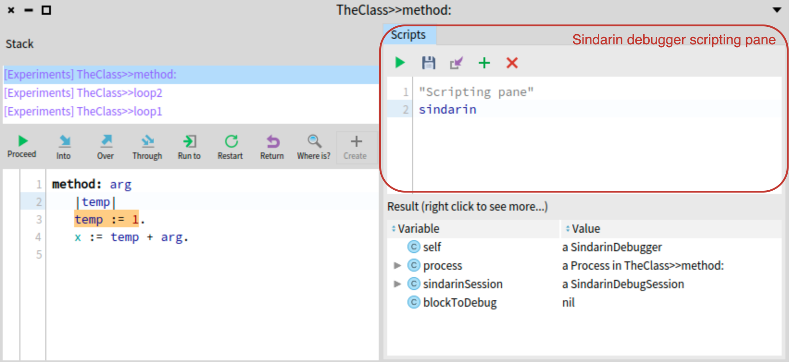

## Scripting the Debugger with Sindarin

- explain what is scripting debuggers
- explain how we script the debugger in Pharo
- show simple examples
- show a stronger example (from HDR?)



Here refering to *@fig:sindarin-script-1@*

```language=Pharo&caption=Defining the name of your debugger extension&label=fig:sindarin-script-1
sindarin stepUntil: [ 
	sindarin selector = #method: 
		and:[sindarin receiver class = TheClass 
			and: [ sindarin arguments first = 5 ]]]
```